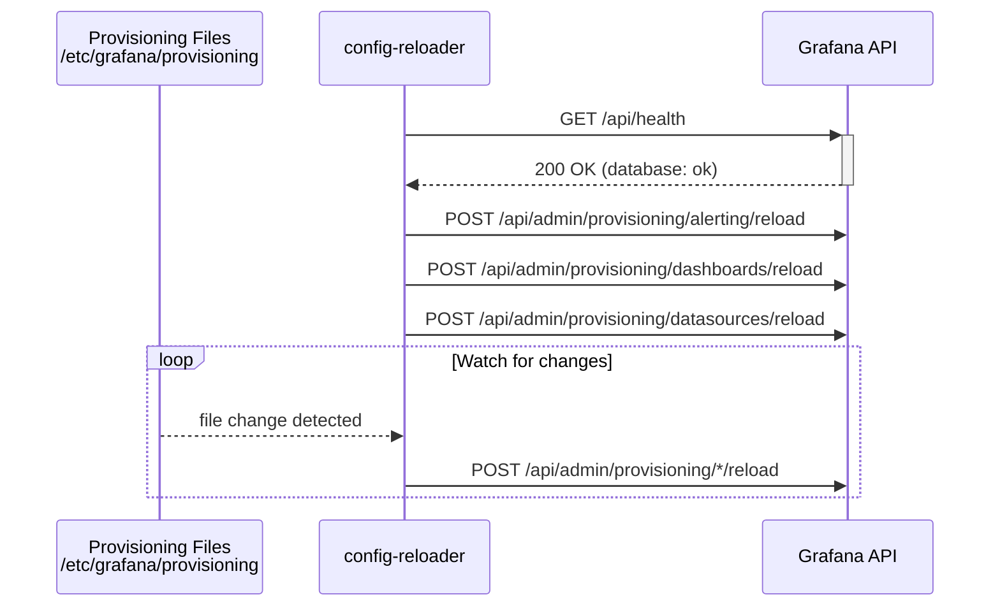

# About

Automatically monitor and reloads the Grafana provisioning config files

## How it works?

- On startup, the reloader waits for Grafana to be ready, then triggers an initial reload of all provisioning configurations
- It continuously monitors the provisioning directory for any changes and calls the [Grafana Admin HTTP API](https://grafana.com/docs/grafana/latest/developers/http_api/admin/#reload-provisioning-configurations) to reload the affected configurations
- All API calls are made using the Grafana admin credentials (`GF_SECURITY_ADMIN_USER` / `GF_SECURITY_ADMIN_PASSWORD`)

The provisioning configurations are stored at `/etc/grafana/provisioning` with the following sub-directories:

- `alerting`: Alerting rules and contact points
- `dashboards`: Dashboard definitions
- `datasources`: Data source definitions

See https://grafana.com/docs/grafana/latest/administration/provisioning for more information.

## Configuration

| Environment variable                                      | Default                     | Description                                                              |
| --------------------------------------------------------- | --------------------------- | ------------------------------------------------------------------------ |
| `GF_SERVER_DOMAIN`                                        | `localhost`                 | Grafana server domain                                                    |
| `GF_SERVER_PROTOCOL`                                      | `http`                      | Grafana server protocol                                                  |
| `GF_SERVER_HTTP_PORT`                                     | `3000`                      | Grafana server port                                                      |
| `GF_SECURITY_ADMIN_USER`                                  | `grafana`                   | Grafana admin username                                                   |
| `GF_SECURITY_ADMIN_PASSWORD`                              | `grafana`                   | Grafana admin password                                                   |
| `GF_SECURITY_ADMIN_PASSWORD__FILE`                        | —                           | Path to a file containing the admin password (Docker secret)             |
| `GF_PATHS_PROVISIONING`                                   | `/etc/grafana/provisioning` | Path to the provisioning directory                                       |
| `GRAFANA_PROVISIONING_CONFIG_RELOADER_LOG_LEVEL`          | `info`                      | Log level (`fatal`, `error`, `warn`, `info`, `debug`, `trace`, `silent`) |
| `GRAFANA_PROVISIONING_CONFIG_RELOADER_ALERTING_ENABLED`   | `true`                      | Enable alerting config reload                                            |
| `GRAFANA_PROVISIONING_CONFIG_RELOADER_DASHBOARD_ENABLED`  | `true`                      | Enable dashboard config reload                                           |
| `GRAFANA_PROVISIONING_CONFIG_RELOADER_DATASOURCE_ENABLED` | `true`                      | Enable datasource config reload                                          |

## Usage

See https://github.com/swarmlibs/promstack/blob/main/grafana/docker-stack.yml for a real-world usage example.

## License

Licensed under [MIT](./LICENSE).
